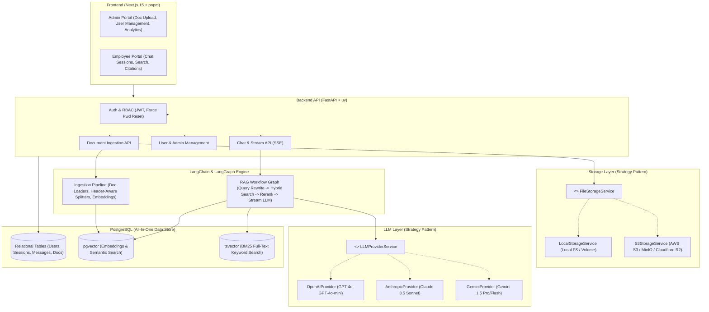
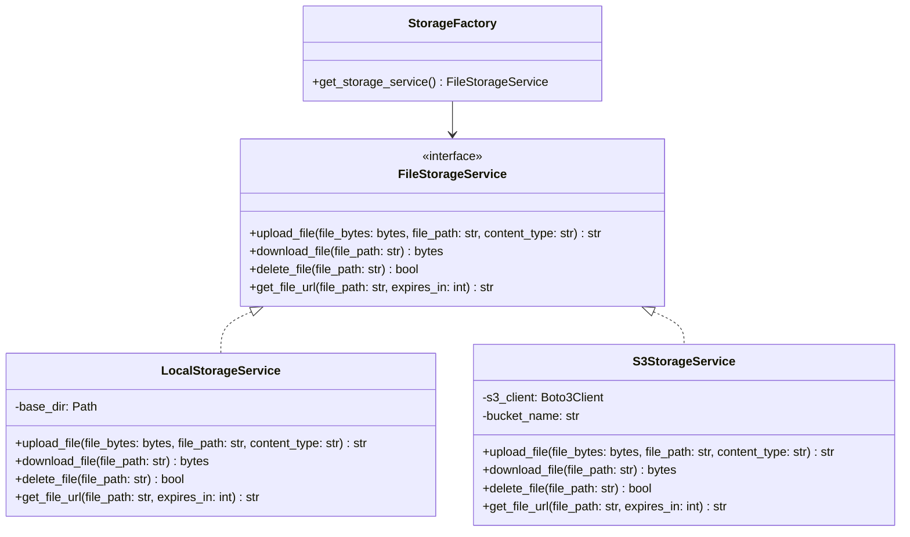
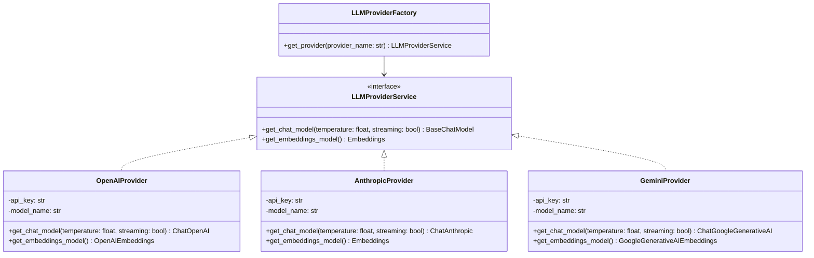
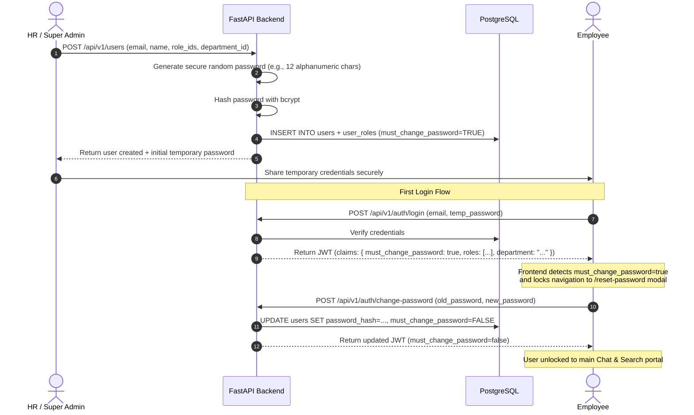
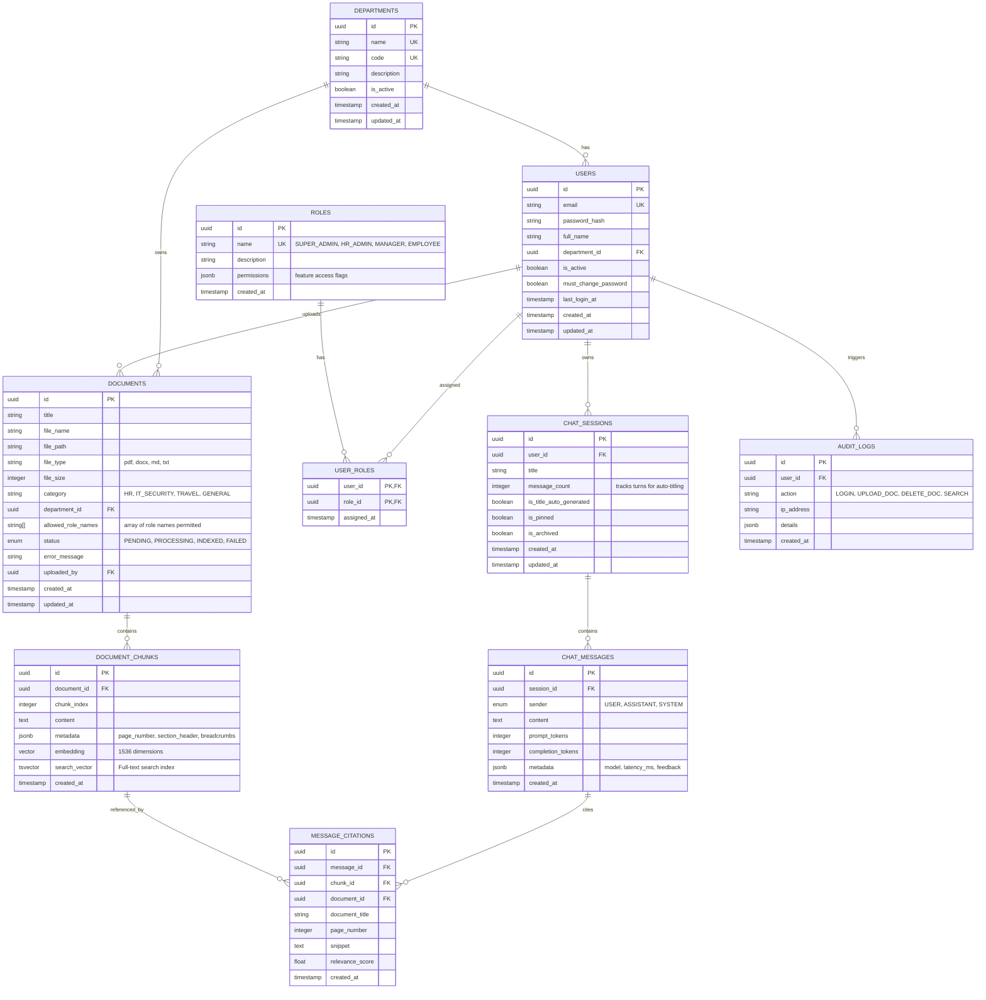
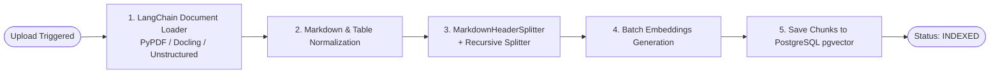

# PolicyHelper - Architecture & Technical Specification

An internal, self-hosted AI chatbot and policy search assistant for company employees and HR/Admin teams.

---

## 1. System Overview & Key Design Decisions

- **Single-Company Self-Hosted**: Dedicated deployment per company without multi-tenant partitioning overhead.
- **Single Unified Database**: **PostgreSQL** handles relational data (users, roles, departments, sessions, messages, documents, audit logs), vector embeddings (`pgvector`), and full-text search (`tsvector`).
- **Orchestration**: Built on **LangChain** and **LangGraph** for document ingestion pipelines, agentic RAG workflows, state management, citations, and **automatic chat session title generation**.
- **Token Streaming Response**: Chat completions stream token-by-token using **Server-Sent Events (SSE)** from LangGraph to the frontend so users see immediate real-time output.
- **Automatic Session Title Generation**: After a fixed message threshold (e.g., turn 1 or turn 2 of user-assistant exchange), a lightweight LLM call asynchronously summarizes the conversation into a concise, meaningful title and updates the session in the DB.
- **Dynamic Roles & Departments (RBAC)**: Dedicated `roles` and `departments` tables with Many-to-Many mapping (`user_roles`) and full CRUD for departments, allowing customizable permissions per employee.
- **Frontend API Layer**: All standard REST API requests (mutations, queries, caching, invalidation) use **TanStack React Query (`@tanstack/react-query`)** with **Axios**, and streaming SSE connections handle real-time chat tokens.
- **Design Patterns**:
  - **Storage Strategy Pattern**: Pluggable storage providers (`LocalStorageService`, `S3StorageService`).
  - **LLM Provider Strategy Pattern**: Pluggable model providers (`OpenAIProvider`, `AnthropicProvider`, `GeminiProvider`).
- **Authentication**: JWT-based (Email & Password), Admin-provisioned users with auto-generated temporary passwords and **mandatory first-login password reset**.
- **Chat History**: Full conversational persistence with multiple chat sessions per user and turn-by-turn message storage in PostgreSQL.
- **Self-Documenting Codebase (`guide.md`)**: Every folder in both `apps/web` and `apps/api` contains a dedicated `guide.md` file explaining the folder structure, detailing responsibilities, and linking to subfolders and files with full context.

---

## 2. High-Level Architecture Diagram



---

## 3. Technology Stack

| Component              | Technology                                              | Role / Justification                                                                |
| :--------------------- | :------------------------------------------------------ | :---------------------------------------------------------------------------------- |
| **Frontend**           | **Next.js 15 (App Router)** + **pnpm** + **TypeScript** | Server components, responsive UI, client routing.                                   |
| **Client API & Cache** | **TanStack React Query** + **Axios**                    | Robust server state management, caching, optimistic updates, and clean HTTP client. |
| **UI Library**         | **shadcn/ui** + **Tailwind CSS** + **Lucide Icons**     | Accessible, enterprise-ready UI components for chat and dashboards.                 |
| **Backend API**        | **FastAPI** + **Python 3.11+** (managed via **uv**)     | Async API framework, dependency injection, high throughput.                         |
| **Streaming Protocol** | **Server-Sent Events (SSE)**                            | Low-latency token-by-token streaming from LangGraph RAG to Next.js chat interface.  |
| **Orchestrator**       | **LangChain** + **LangGraph**                           | Document loaders, chunkers, state graphs for RAG retrieval and streaming.           |
| **Database**           | **PostgreSQL 16+** with **`pgvector`** extension        | Single data layer for relational metadata, vector embeddings, and full-text search. |
| **ORM & Migrations**   | **SQLAlchemy 2.0 (Async)** + **Alembic**                | Async database access and schema migrations.                                        |
| **Auth**               | **JWT (python-jose / PyJWT)** + **Argon2 / bcrypt**     | Access & Refresh tokens, secure password hashing, force-reset state.                |
| **Task Execution**     | **BackgroundTasks (FastAPI)** or **ARQ / Celery**       | Async document parsing, chunking, and embedding generation.                         |

---

## 4. Chunking Strategies Analysis & Recommendation

Policy documents (e.g., HR handbooks, IT security guidelines, travel policies, insurance plans) are typically structured with numbered headings, sub-clauses, tables, and specific conditions. Selecting the right chunking strategy is vital to avoid fragmenting rules from their context.

### 4.1 Available Chunking Strategies

| Strategy                                                              | How It Works                                                                                                                           | Pros                                                                                        | Cons                                                                       | Best Used For                                         |
| :-------------------------------------------------------------------- | :------------------------------------------------------------------------------------------------------------------------------------- | :------------------------------------------------------------------------------------------ | :------------------------------------------------------------------------- | :---------------------------------------------------- |
| **1. Fixed-Size Character / Token Chunking**                          | Splits text every $N$ characters/tokens with $K$ overlap (e.g., 500 chars, 50 overlap).                                                | Simple, fast, uniform chunk sizes.                                                          | Breaks sentences and tables across chunks; loses structural context.       | Raw unstructured logs, plain text.                    |
| **2. Recursive Character Splitting**                                  | Recursively splits by `\n\n`, `\n`, `. `, ` ` to keep paragraphs intact.                                                               | Keeps paragraphs and logical sentences together.                                            | May split a sub-clause away from its parent heading/section context.       | General articles, wiki pages.                         |
| **3. Markdown / Document Header-Aware Chunking** _(Recommended)_      | Splits documents along `# H1`, `## H2`, `### H3` structural headers, embedding header breadcrumbs into metadata.                       | Preserves the exact section hierarchy (e.g., _Section 4.2 > Parental Leave > Eligibility_). | Uneven chunk sizes if sections are very long or very short.                | Structured handbooks, policy manuals.                 |
| **4. Semantic Chunking**                                              | Computes cosine distance between consecutive sentences and splits when topic distance spikes.                                          | Dynamically creates chunks based on semantic shifts.                                        | Computationally expensive; unpredictable chunk sizes; fails on table data. | Long-form narratives, essays.                         |
| **5. Hierarchical / Parent-Child Chunking** _(Recommended Extension)_ | Creates small sub-chunks (150 tokens) for precise vector matching, but retrieves the larger parent chunk (800 tokens) for LLM context. | High retrieval precision without losing the wider context around a policy rule.             | Requires storing both parent and child chunk records in the database.      | Dense, fine-grained policies with specific sub-rules. |

### 4.2 Recommended Strategy for PolicyHelper

We will use a **Hybrid Header-Aware Recursive Chunking with Breadcrumbs**:

1. **Document Parsing via LangChain**: Convert `.pdf`, `.docx`, `.md` into structured Markdown (preserving tables and markdown headers).
2. **Markdown Header Splitting**: Split based on headers (`#`, `##`, `###`).
3. **Context Breadcrumb Injection**: Prepend the hierarchical path (e.g., `Document: Leave Policy > Section: Paid Time Off > Eligibility`) to each chunk.
4. **Secondary Recursive Splitting**: If a section exceeds 800 tokens, apply `RecursiveCharacterTextSplitter` with 15% overlap to keep chunk sizes within the embedding model's sweet spot.

---

## 5. Architectural Design Patterns

### 5.1 Document Storage Strategy Pattern

Decouple physical storage from document management logic using an abstract base class.



- **`LocalStorageService`**: Writes files to local filesystem directory (e.g., `/data/policies/`), useful for local development and self-hosted single servers.
- **`S3StorageService`**: Compatible with AWS S3, Cloudflare R2, MinIO, or Ceph using standard S3 protocol.
- **`StorageFactory`**: Returns the appropriate instance based on `STORAGE_TYPE` environment variable (`local` vs `s3`).

---

### 5.2 LLM Provider Strategy Pattern

Supports switching or mixing providers (OpenAI, Anthropic Claude, Google Gemini) via a unified interface.



---

## 6. Authentication, RBAC & First-Time Login Workflow

### 6.1 Dynamic Roles & Departments (Many-to-Many Architecture)

Rather than rigid enum strings, roles and departments are decoupled into dedicated relational tables:

- **`roles` Table**: Contains system roles (e.g., `SUPER_ADMIN`, `HR_ADMIN`, `MANAGER`, `EMPLOYEE`, custom roles) and permission bitmasks/flags.
- **`user_roles` Junction Table**: Many-to-Many mapping allowing a user to possess multiple roles simultaneously.
- **`departments` Table**: Full CRUD support (Create, Read, Update, and soft Delete) for company organizational units (e.g., _Engineering_, _Human Resources_, _Legal & Compliance_, _Sales_, _Finance_). Users and policy documents are linked directly to departments.

### 6.2 Admin User Creation & First-Time Login Sequence



---

## 7. Database Schema & Entity Relationships

All tables are defined in PostgreSQL. The `document_chunks` table includes a `pgvector` column `embedding vector(1536)` (or 768 / 3072 depending on the selected embedding model) and a `tsvector` column for full-text search.



### 7.1 Key Schema Definitions (SQL / SQLAlchemy)

```sql
-- Enable pgvector and uuid extensions
CREATE EXTENSION IF NOT EXISTS "uuid-ossp";
CREATE EXTENSION IF NOT EXISTS vector;

-- Departments Table (Full CRUD)
CREATE TABLE departments (
    id UUID PRIMARY KEY DEFAULT uuid_generate_v4(),
    name VARCHAR(150) UNIQUE NOT NULL,
    code VARCHAR(50) UNIQUE NOT NULL, -- e.g. 'ENG', 'HR', 'SALES'
    description TEXT,
    is_active BOOLEAN NOT NULL DEFAULT TRUE,
    created_at TIMESTAMP WITH TIME ZONE DEFAULT NOW(),
    updated_at TIMESTAMP WITH TIME ZONE DEFAULT NOW()
);

-- Roles Table
CREATE TABLE roles (
    id UUID PRIMARY KEY DEFAULT uuid_generate_v4(),
    name VARCHAR(50) UNIQUE NOT NULL, -- 'SUPER_ADMIN', 'HR_ADMIN', 'MANAGER', 'EMPLOYEE'
    description TEXT,
    permissions JSONB NOT NULL DEFAULT '{}'::jsonb,
    created_at TIMESTAMP WITH TIME ZONE DEFAULT NOW()
);

-- Users Table
CREATE TABLE users (
    id UUID PRIMARY KEY DEFAULT uuid_generate_v4(),
    email VARCHAR(255) UNIQUE NOT NULL,
    password_hash VARCHAR(255) NOT NULL,
    full_name VARCHAR(255) NOT NULL,
    department_id UUID REFERENCES departments(id) ON DELETE SET NULL,
    is_active BOOLEAN NOT NULL DEFAULT TRUE,
    must_change_password BOOLEAN NOT NULL DEFAULT TRUE,
    last_login_at TIMESTAMP WITH TIME ZONE,
    created_at TIMESTAMP WITH TIME ZONE DEFAULT NOW(),
    updated_at TIMESTAMP WITH TIME ZONE DEFAULT NOW()
);

-- User Roles Junction Table (Many-to-Many)
CREATE TABLE user_roles (
    user_id UUID NOT NULL REFERENCES users(id) ON DELETE CASCADE,
    role_id UUID NOT NULL REFERENCES roles(id) ON DELETE CASCADE,
    assigned_at TIMESTAMP WITH TIME ZONE DEFAULT NOW(),
    PRIMARY KEY (user_id, role_id)
);

-- Documents Table
CREATE TABLE documents (
    id UUID PRIMARY KEY DEFAULT uuid_generate_v4(),
    title VARCHAR(255) NOT NULL,
    file_name VARCHAR(255) NOT NULL,
    file_path VARCHAR(500) NOT NULL,
    file_type VARCHAR(50) NOT NULL,
    file_size INTEGER NOT NULL,
    category VARCHAR(100) NOT NULL DEFAULT 'GENERAL',
    department_id UUID REFERENCES departments(id) ON DELETE SET NULL,
    allowed_role_names TEXT[] NOT NULL DEFAULT ARRAY['EMPLOYEE', 'MANAGER', 'HR_ADMIN', 'SUPER_ADMIN'],
    status VARCHAR(50) NOT NULL DEFAULT 'PENDING', -- PENDING, PROCESSING, INDEXED, FAILED
    error_message TEXT,
    uploaded_by UUID REFERENCES users(id) ON DELETE SET NULL,
    created_at TIMESTAMP WITH TIME ZONE DEFAULT NOW(),
    updated_at TIMESTAMP WITH TIME ZONE DEFAULT NOW()
);

-- Document Chunks with pgvector & Full-Text Search
CREATE TABLE document_chunks (
    id UUID PRIMARY KEY DEFAULT uuid_generate_v4(),
    document_id UUID NOT NULL REFERENCES documents(id) ON DELETE CASCADE,
    chunk_index INTEGER NOT NULL,
    content TEXT NOT NULL,
    metadata JSONB NOT NULL DEFAULT '{}'::jsonb,
    embedding vector(1536), -- Dimension matches embedding model
    search_vector tsvector GENERATED ALWAYS AS (to_tsvector('english', content)) STORED,
    created_at TIMESTAMP WITH TIME ZONE DEFAULT NOW()
);

-- Indexes for Hybrid Search
CREATE INDEX idx_chunks_doc_id ON document_chunks(document_id);
CREATE INDEX idx_chunks_embedding ON document_chunks USING hnsw (embedding vector_cosine_ops);
CREATE INDEX idx_chunks_fts ON document_chunks USING gin(search_vector);

-- Chat Sessions with Auto-Title tracking
CREATE TABLE chat_sessions (
    id UUID PRIMARY KEY DEFAULT uuid_generate_v4(),
    user_id UUID NOT NULL REFERENCES users(id) ON DELETE CASCADE,
    title VARCHAR(255) NOT NULL DEFAULT 'New Conversation',
    message_count INTEGER NOT NULL DEFAULT 0,
    is_title_auto_generated BOOLEAN NOT NULL DEFAULT FALSE,
    is_pinned BOOLEAN NOT NULL DEFAULT FALSE,
    is_archived BOOLEAN NOT NULL DEFAULT FALSE,
    created_at TIMESTAMP WITH TIME ZONE DEFAULT NOW(),
    updated_at TIMESTAMP WITH TIME ZONE DEFAULT NOW()
);

-- Chat Messages
CREATE TABLE chat_messages (
    id UUID PRIMARY KEY DEFAULT uuid_generate_v4(),
    session_id UUID NOT NULL REFERENCES chat_sessions(id) ON DELETE CASCADE,
    sender VARCHAR(20) NOT NULL, -- USER, ASSISTANT, SYSTEM
    content TEXT NOT NULL,
    prompt_tokens INTEGER DEFAULT 0,
    completion_tokens INTEGER DEFAULT 0,
    metadata JSONB DEFAULT '{}'::jsonb,
    created_at TIMESTAMP WITH TIME ZONE DEFAULT NOW()
);

-- Message Citations
CREATE TABLE message_citations (
    id UUID PRIMARY KEY DEFAULT uuid_generate_v4(),
    message_id UUID NOT NULL REFERENCES chat_messages(id) ON DELETE CASCADE,
    chunk_id UUID REFERENCES document_chunks(id) ON DELETE SET NULL,
    document_id UUID REFERENCES documents(id) ON DELETE CASCADE,
    document_title VARCHAR(255) NOT NULL,
    page_number INTEGER,
    snippet TEXT NOT NULL,
    relevance_score FLOAT,
    created_at TIMESTAMP WITH TIME ZONE DEFAULT NOW()
);
```

---

## 8. LangGraph Orchestration Workflows

### 8.1 Ingestion StateGraph



### 8.2 RAG Chat & Retrieval StateGraph

```mermaid
graph TD
    QueryIn([User Message]) --> Rewrite[1. Query Condenser / History Contextualizer]
    Rewrite --> HybridRetrieval[2. Hybrid Retrieval in PostgreSQL<br/>Dense Cosine + Sparse tsvector]
    HybridRetrieval --> RBACFilter[3. RBAC & Department Filter]
    RBACFilter --> Rerank[4. Cross-Encoder / Reciprocal Rank Fusion]
    Rerank --> CheckRelevance{Relevant Chunks Found?}
    CheckRelevance -- Yes --> GeneratePrompt[5. Build Grounded Prompt with Citations]
    CheckRelevance -- No --> Fallback[5b. Fallback: No policy found, refer to HR]
    GeneratePrompt --> StreamLLM[6. Stream Tokens via SSE (OpenAI/Claude/Gemini)]
    Fallback --> StreamLLM
    StreamLLM --> SaveDB[7. Persist Message & Citations to PostgreSQL]
    SaveDB --> End([Stream Complete])
```

### 8.3 Token Streaming Specification (Server-Sent Events)

To ensure zero latency perception for users, the chat endpoint `/api/v1/chat/sessions/{session_id}/stream` uses Server-Sent Events (`text/event-stream`).

#### Event Stream Protocol:

1. **`event: citation`**: Dispatched as soon as retrieval and reranking complete, delivering source document metadata.
   ```json
   {
     "event": "citation",
     "data": {
       "document_id": "...",
       "title": "Leave Policy 2026",
       "page_number": 4,
       "snippet": "..."
     }
   }
   ```
2. **`event: token`**: Dispatched per generated token chunk from the LLM.
   ```json
   { "event": "token", "data": { "content": "According" } }
   ```
3. **`event: done`**: Dispatched upon completion with the saved message ID and token metrics.
   ```json
   {
     "event": "done",
     "data": {
       "message_id": "...",
       "prompt_tokens": 120,
       "completion_tokens": 45
     }
   }
   ```
4. **`event: session_updated`**: Dispatched when the session title has been automatically summarized and updated in the DB.
   ```json
   {
     "event": "session_updated",
     "data": { "session_id": "...", "title": "PTO & Sick Leave Policies" }
   }
   ```
5. **`event: error`**: Dispatched in case of execution failure.
   ```json
   {
     "event": "error",
     "data": { "message": "Failed to retrieve policy details." }
   }
   ```

### 8.4 Automated Chat Session Titling Pipeline

1. **Trigger Condition**: When `session.message_count` reaches a fixed threshold (default: 2 messages / 1 complete turn) and `is_title_auto_generated == FALSE`.
2. **Background Execution**: Runs asynchronously (does not block token streaming to the user).
3. **Prompt & Generation**: Uses a fast LLM call (e.g. `gpt-4o-mini` or `gemini-1.5-flash`) with prompt:
   > _"Summarize the following user-assistant policy question into a concise 3-5 word title without quotes or punctuation: {user_query}"_
4. **Persistence & UI Notification**:
   - Saves the updated title to `chat_sessions.title` and sets `is_title_auto_generated = TRUE`.
   - Emits `event: session_updated` over SSE or updates TanStack Query session list cache on the next turn.

---

## 9. Frontend API Integration Architecture (TanStack React Query + Axios)

1. **Axios Client Instance (`lib/api/client.ts`)**:
   - Centralized Axios instance with request/response interceptors.
   - Automatically attaches JWT Bearer token from local storage / cookies.
   - Handles global 401 Unauthorized errors (redirecting to `/login` or triggering token refresh).
   - Enforces password change redirect if response contains `must_change_password: true`.

2. **TanStack React Query Hooks (`hooks/`)**:
   - **`useAuth`**: Handles `login`, `changePassword`, and session state.
   - **`useChatSessions`**: Fetches user's chat sessions, manages pagination, cache invalidation, renaming, and archiving.
   - **`useChatMessages(sessionId)`**: Loads message history for a given session.
   - **`useDocuments`**: Fetches document catalog, status polling (query interval for `PROCESSING` documents), upload mutation, and deletion.
   - **`useUsers`**: Admin query and mutations for adding users with auto-generated passwords.

3. **Streaming Hook (`useChatStream`)**:
   - Integrates with React Query cache to optimistically insert the user's message.
   - Reads the SSE stream using `fetch` with `ReadableStream` / `EventSource`, progressively appending tokens to the active message in state.
   - On `event: done`, invalidates React Query session cache to synchronize persisted database state.

---

## 10. Frontend Architecture, Design Philosophy & Component Guidelines

### 10.1 DRY & Modular Component Architecture

- **Single Responsibility**: Components must have one clear purpose. When a component file grows beyond ~150–200 lines or starts handling disparate concerns (e.g. state management, formatting, nested UI parts), decompose it into focused sub-components.
- **Dedicated Sub-component Files**: Never define multiple non-trivial components in a single file. Sub-components must be exported from their own dedicated files inside feature component directories (e.g. `components/chat/message-item.tsx`, `components/chat/citation-badge.tsx`, `components/chat/chat-input.tsx`).
- **Reusable Primitives & Custom Hooks**: Extract repeated logic into custom React hooks (`hooks/`) and reusable UI primitives (`components/ui/`, `components/common/`) to strictly follow the DRY (Don't Repeat Yourself) principle.

### 10.2 Design Philosophy: Subtle & Classic (Zero AI Slob)

- **Classic Enterprise Aesthetics**:
  - Clean, neutral color palette (monochrome slate/zinc, subtle subtle borders `#E2E8F0` / `#27272A`, refined typography with Geist/Inter).
  - High information density with generous, purposeful whitespace — avoiding unnecessary animations, tacky neon gradients, or floating particles.
  - Consistent micro-interactions (subtle hover states, crisp focus rings, smooth skeleton loading states).
- **Subtle AI Indicator Patterns**:
  - LLM answers displayed cleanly like standard markdown documentation, using classic typography hierarchy.
  - Citations rendered as discreet, elegant badge chips (e.g., `📄 Travel Policy 2026, p. 12`) that open crisp preview dialogs or sidebars upon clicking.
  - Streaming cursor indicated by a minimal blinking caret or subtle status indicator rather than noisy glowing effects.

### 10.3 Fluid Responsive Design

- **Mobile-First Breakpoints**: Tailored responsive layouts using Tailwind CSS breakpoints (`sm:`, `md:`, `lg:`, `xl:`).
- **Adaptive Navigation**:
  - Desktop: Collapsible multi-session sidebar with quick search and active session grouping (Today, Previous 7 Days, Older).
  - Mobile / Tablet: Drawer/sheet sidebar with backdrop blur and touch-optimized touch targets (minimum 44x44px).
- **Responsive Split Views**: On wide screens, PDF/document citations preview alongside the chat pane; on mobile, citations open in an overlay bottom-sheet or modal.

---

## 11. Self-Documentation Convention (`guide.md`)

Every directory created in the repository must maintain a `guide.md` file:

- **Directory Summary**: Purpose and responsibilities of the folder.
- **File Index & Context**: Table listing every file in that folder with a brief description and link.
- **Subdirectory Index**: Links to subdirectories and their respective `guide.md` files.
- **Architecture Notes & Conventions**: Specific coding standards or rules that apply to that folder.

---

## 12. Project Repository Structure

```
PolicyHelper/
├── guide.md                           # Root workspace guide & navigation index
├── apps/
│   ├── guide.md                       # Apps directory guide
│   ├── web/                           # Next.js 15 Frontend (pnpm)
│   │   ├── guide.md                   # Web app guide & routing index
│   │   ├── app/
│   │   │   ├── guide.md
│   │   │   ├── (auth)/
│   │   │   │   ├── login/             # Email/Password Login
│   │   │   │   └── change-password/   # First-Time Password Reset
│   │   │   ├── (dashboard)/
│   │   │   │   ├── chat/              # Multi-session Chatbot & History Sidebar
│   │   │   │   ├── search/            # Direct Policy Keyword & Vector Search
│   │   │   │   ├── documents/         # Admin Document Upload & Status
│   │   │   │   ├── users/             # Admin User Management & Invite Modal
│   │   │   │   └── analytics/         # Knowledge Gap & Query Insights
│   │   │   └── api/                   # Route handlers
│   │   ├── components/
│   │   │   ├── guide.md
│   │   │   ├── chat/                  # MessageList, ChatInput, CitationsPanel
│   │   │   ├── documents/             # UploadZone, DocumentTable, PDFPreview
│   │   │   └── ui/                    # shadcn/ui components
│   │   ├── hooks/                     # TanStack Query & SSE streaming custom hooks
│   │   │   ├── guide.md
│   │   ├── lib/                       # Axios client, query client, auth utils
│   │   │   ├── guide.md
│   │   └── package.json
│   │
│   └── api/                           # FastAPI Backend (uv)
│       ├── guide.md                   # Backend application guide
│       ├── app/
│       │   ├── guide.md
│       │   ├── core/                  # Pydantic Settings, JWT security, Async DB session
│       │   ├── models/                # SQLAlchemy Models (User, Document, Chunk, Chat, Audit)
│       │   ├── schemas/               # Pydantic validation schemas
│       │   ├── api/v1/                # REST & SSE Streaming Endpoints (auth, users, docs, chat)
│       │   ├── services/
│       │   │   ├── storage/           # Strategy Pattern (base, local, s3, factory)
│       │   │   ├── llm/               # Strategy Pattern (base, openai, anthropic, gemini, factory)
│       │   │   ├── ingestion/         # LangChain/LangGraph parsing & chunking
│       │   │   └── rag/               # LangGraph RAG execution graph & hybrid search
│       │   └── main.py                # FastAPI app initialization
│       ├── alembic/                   # Database migrations
│       ├── pyproject.toml             # uv package dependencies
│       └── tests/
│
├── docker-compose.yml                 # Local PostgreSQL (with pgvector) & MinIO/Local dev
├── ARCHITECTURE.md                    # This document
└── README.md
```
