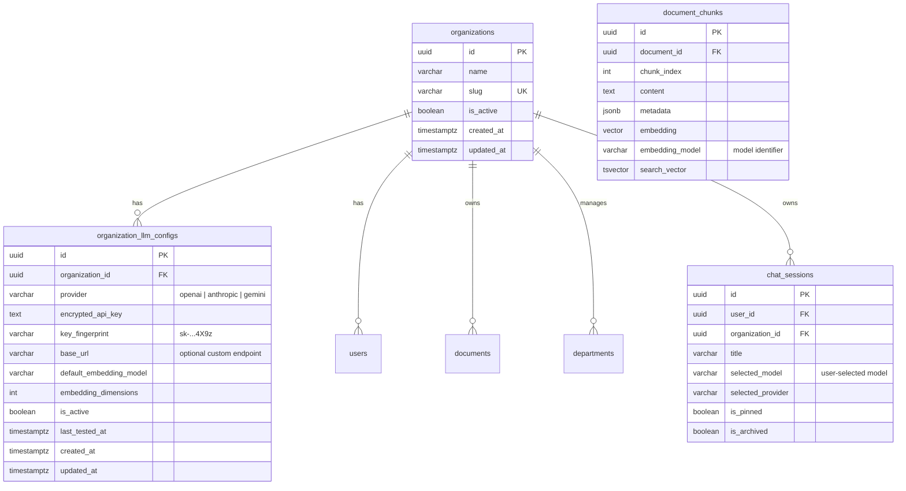
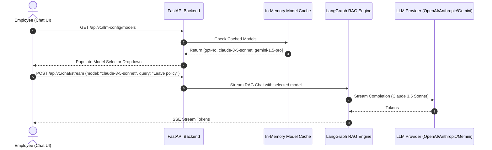
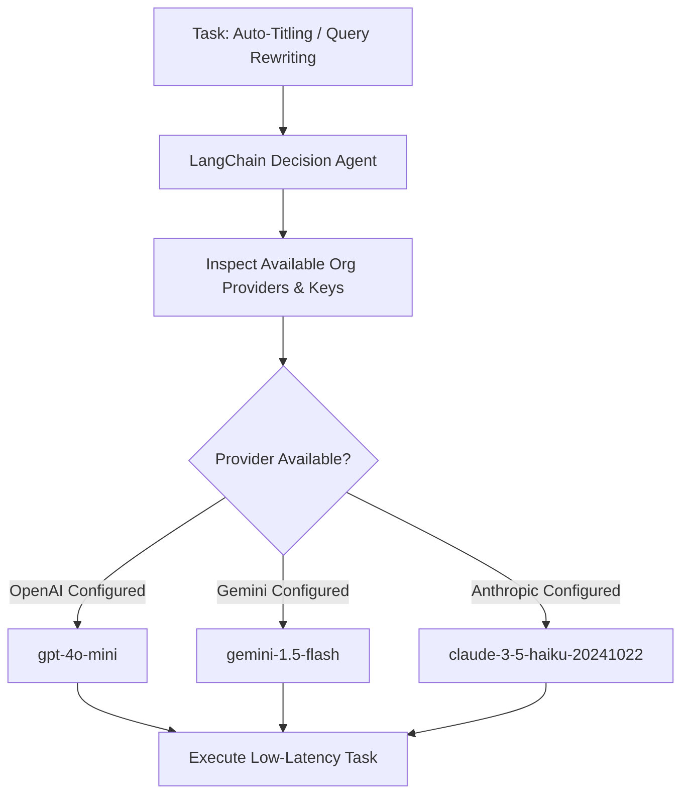
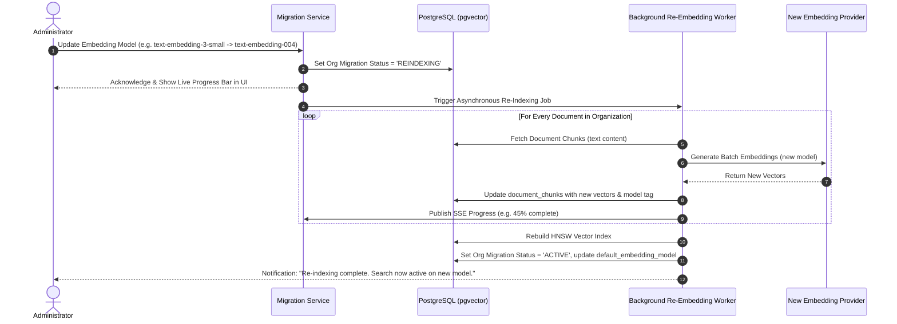

# Dynamic Multi-Provider LLM & Organization-Level Strategy Architecture

## Executive Summary

This document outlines the end-to-end design, database schema restructuring, security measures, LangChain decision agent, and operational migration workflows for enabling dynamic LLM provider management at the database and organization level for **PolicyHelper**.

---

## 1. Scope & Core Requirements

1. **Supported LLM Providers (Initial Scope)**:
   - **OpenAI** (Chat, Reasoning, Embeddings)
   - **Anthropic** (Claude Chat & Reasoning models)
   - **Google Gemini** (Gemini 1.5/2.0 Flash/Pro, Text Embeddings)
2. **Organization-Level Administration**:
   - Administrators configure the organization name, select their LLM provider(s), and input the provider API key in the Admin UI.
   - API keys are encrypted at rest using AES-256 (Fernet) before storing in PostgreSQL.
3. **End-User Dynamic Chat Model Selection**:
   - The admin does **not** hardcode a single chat model.
   - The backend dynamically queries model lists from respective vendor APIs, filters compatible chat/reasoning models, and maintains them in an in-memory TTL cache.
   - End users in the chat interface can pick their preferred model from the dynamically populated list.
4. **LangChain Decision & Routing Agent**:
   - An internal LangChain agent autonomously analyzes system state, latency/cost requirements, and available provider credentials to select:
     - The optimal fast/lightweight model for **auto-titling** and **query expansion/rewriting**.
     - The default **embedding model** if unspecified.
5. **Embedding Model Change & Re-Indexing Lifecycle**:
   - A structured protocol to handle vector space incompatibility and dimension changes in `pgvector` during embedding model updates with zero query downtime.

---

## 2. Database Schema Restructuring



### 2.1 `organizations` Model

```python
class Organization(Base):
    __tablename__ = "organizations"

    id: Mapped[uuid.UUID] = mapped_column(UUID(as_uuid=True), primary_key=True, default=uuid.uuid4)
    name: Mapped[str] = mapped_column(String(255), nullable=False)
    slug: Mapped[str] = mapped_column(String(100), unique=True, nullable=False, index=True)
    is_active: Mapped[bool] = mapped_column(Boolean, default=True, nullable=False)
    created_at: Mapped[datetime] = mapped_column(DateTime(timezone=True), default=lambda: datetime.now(timezone.utc))
    updated_at: Mapped[datetime] = mapped_column(DateTime(timezone=True), default=lambda: datetime.now(timezone.utc), onupdate=lambda: datetime.now(timezone.utc))

    llm_configs: Mapped[list["OrganizationLLMConfig"]] = relationship("OrganizationLLMConfig", back_populates="organization", cascade="all, delete-orphan")
```

### 2.2 `organization_llm_configs` Model

```python
class OrganizationLLMConfig(Base):
    __tablename__ = "organization_llm_configs"

    id: Mapped[uuid.UUID] = mapped_column(UUID(as_uuid=True), primary_key=True, default=uuid.uuid4)
    organization_id: Mapped[uuid.UUID] = mapped_column(UUID(as_uuid=True), ForeignKey("organizations.id", ondelete="CASCADE"), nullable=False, index=True)
    provider: Mapped[str] = mapped_column(String(50), nullable=False)  # 'openai', 'anthropic', 'gemini'
    encrypted_api_key: Mapped[str] = mapped_column(Text, nullable=False)
    key_fingerprint: Mapped[str] = mapped_column(String(64), nullable=False)
    base_url: Mapped[str | None] = mapped_column(String(500), nullable=True)

    # Active embedding model settings (fixed per org to preserve vector consistency)
    default_embedding_model: Mapped[str] = mapped_column(String(100), nullable=False, default="text-embedding-3-small")
    embedding_dimensions: Mapped[int] = mapped_column(Integer, nullable=False, default=1536)

    is_active: Mapped[bool] = mapped_column(Boolean, default=True, nullable=False)
    last_tested_at: Mapped[datetime | None] = mapped_column(DateTime(timezone=True), nullable=True)
    created_at: Mapped[datetime] = mapped_column(DateTime(timezone=True), default=lambda: datetime.now(timezone.utc))
    updated_at: Mapped[datetime] = mapped_column(DateTime(timezone=True), default=lambda: datetime.now(timezone.utc), onupdate=lambda: datetime.now(timezone.utc))

    organization: Mapped["Organization"] = relationship("Organization", back_populates="llm_configs")
```

---

## 3. Cryptography & Secret Handling

To ensure enterprise-grade security:

1. **Symmetric Encryption**:
   - Use AES-256 via `cryptography.fernet.Fernet`.
   - The master encryption key is securely derived via SHA-256 from `JWT_SECRET_KEY` configured in the server environment.
2. **Masked Fingerprint**:
   - Generate a fingerprint (e.g. `sk-proj-...8Ab3`) upon saving.
   - REST responses **never** transmit the decrypted API key back to the frontend.
3. **Decryption at Runtime**:
   - Decryption happens exclusively in-memory inside the LLM factory when instantiating client wrappers.

---

## 4. Vendor Model Discovery & In-Memory Caching

### 4.1 Live Vendor Introspection

When the admin submits or updates an API key, or when the chat interface queries available models, the backend fetches available models directly from the vendor APIs:

| Vendor            | Discovery Method                                              | Filter Criteria                                                      |
| :---------------- | :------------------------------------------------------------ | :------------------------------------------------------------------- |
| **OpenAI**        | `GET https://api.openai.com/v1/models`                        | Include IDs starting with `gpt-`, `o1`, `o3`, `chatgpt-`             |
| **Anthropic**     | `GET https://api.anthropic.com/v1/models`                     | Include IDs starting with `claude-`                                  |
| **Google Gemini** | `GET https://generativelanguage.googleapis.com/v1beta/models` | Filter where `supportedGenerationMethods` includes `generateContent` |

### 4.2 In-Memory TTL Cache Layer

To prevent rate-limiting vendor APIs and eliminate latency:

- Models are cached in-memory with a **1-hour TTL** per `(org_id, provider)`.
- If an admin updates the API key, the cache entry is immediately invalidated.

```python
# app/services/llm/model_discovery.py
class ModelDiscoveryService:
    _cache: dict[str, tuple[datetime, list[ModelInfo]]] = {}

    @classmethod
    async def get_available_chat_models(cls, org_id: uuid.UUID, provider: str, api_key: str) -> list[ModelInfo]:
        cache_key = f"{org_id}:{provider}"
        now = datetime.now(timezone.utc)

        if cache_key in cls._cache:
            timestamp, cached_models = cls._cache[cache_key]
            if (now - timestamp).total_seconds() < 3600:
                return cached_models

        models = await cls._fetch_from_vendor(provider, api_key)
        cls._cache[cache_key] = (now, models)
        return models
```

---

## 5. End-User Dynamic Model Selection in Chat

### 5.1 Chat Interface Flow

1. When opening a chat session, the frontend calls `/api/v1/llm-config/models` to retrieve available models for the organization.
2. A model selector dropdown appears in the chat header and input bar:
   - e.g., `[ Claude 3.5 Sonnet | GPT-4o | Gemini 1.5 Pro | GPT-4o-mini ]`
3. The selected `model_name` and `provider` are sent in the `POST /api/v1/chat/stream` request payload.
4. The LangGraph RAG stream instantiates the user-chosen chat model dynamically for that response.



---

## 6. LangChain Decision & Routing Agent

The application uses an internal LangChain routing agent for tasks that should be autonomous and transparent to the end-user:

### 6.1 Fast Model Routing (Title Generation & Query Expansion)

For fast, low-latency background operations (summarizing conversation titles, expanding search keywords), the Decision Agent evaluates active configurations and picks the most cost-effective and fastest model available:



### 6.2 Embedding Provider Routing

If the user uploads documents or executes vector search:

- **OpenAI**: Uses `text-embedding-3-small` (1536 dims) or `text-embedding-3-large`.
- **Gemini**: Uses `models/text-embedding-004` (768 dims).
- **Anthropic**: Anthropic does not provide native embeddings; the Decision Agent automatically routes embedding requests to the secondary configured embedding engine or fallback embedding model.

---

## 7. Embedding Model Change Strategy & Migration Steps

Changing an embedding model invalidates all existing vector distances and often alters the vector dimensionality (e.g. switching from OpenAI 1536 dims to Gemini 768 dims).

### 7.1 Required Migration Steps



### 7.2 Zero-Downtime Re-indexing Protocol

1. **Dual-Column or Model-Tagged Storage**:
   - `document_chunks` records include `embedding_model` string alongside `embedding`.
2. **Read-During-Migration Fallback**:
   - While re-indexing is in progress, search queries use Full-Text Search (`tsvector`) + remaining legacy embeddings to guarantee 100% search availability.
3. **Flexible Vector Indexing**:
   - When vector dimensions change (e.g. 1536 to 768), an Alembic migration dynamically adjusts the vector column dimension or utilizes a secondary embedding column (`embedding_v2`) before hot-swapping.
4. **Batch Processing with Backoff**:
   - Chunks are embedded in batches of 50 with exponential backoff to respect vendor rate limits.

---

## 8. API Specifications

### 8.1 Admin Configuration Endpoints

- `GET /api/v1/organization`: Fetch organization profile and active LLM configuration status.
- `POST /api/v1/organization`: Create or update organization details.
- `POST /api/v1/llm-config/test-and-save`: Validate provider credentials, test connection against live API, discover available models, and save encrypted configuration.
- `POST /api/v1/llm-config/reindex`: Trigger background re-embedding pipeline when embedding model is altered.
- `GET /api/v1/llm-config/reindex/status`: Poll progress of ongoing re-indexing operations.

### 8.2 End-User Model Discovery Endpoint

- `GET /api/v1/llm-config/models`: Returns list of available chat models for the authenticated user's organization:

```json
{
  "provider": "openai",
  "models": [
    { "id": "gpt-4o", "name": "GPT-4o (Omni)", "category": "flagship" },
    { "id": "gpt-4o-mini", "name": "GPT-4o Mini (Fast)", "category": "fast" },
    { "id": "o1-mini", "name": "o1 Mini (Reasoning)", "category": "reasoning" }
  ],
  "default_model": "gpt-4o"
}
```

### 8.3 Chat Stream Endpoint

- `POST /api/v1/chat/stream`:

```json
{
  "session_id": "9b1deb4d-3b7d-4bad-9bdd-2b0d7b3dcb6d",
  "message": "What is the policy on paternity leave?",
  "model": "gpt-4o",
  "provider": "openai"
}
```

---

## 9. Phased Implementation Plan

### Phase 1: Database & Core Security

- [ ] Create Alembic migration for `organizations` and `organization_llm_configs` tables.
- [ ] Implement `app/core/crypto.py` with Fernet AES-256 encryption/decryption utilities.
- [ ] Seed default organization and migrate existing users/documents.

### Phase 2: Dynamic Vendor Model Discovery & In-Memory Cache

- [ ] Implement `app/services/llm/discovery.py` supporting OpenAI, Anthropic, and Google Gemini.
- [ ] Implement in-memory TTL caching with cache invalidation triggers.
- [ ] Create REST endpoints for testing API keys and listing active models.

### Phase 3: LangChain Decision Agent & Runtime Factory

- [ ] Build `DynamicLLMProviderFactory` resolving provider configurations from DB + cache.
- [ ] Implement LangChain Decision Agent for fast titling and query expansion model selection.
- [ ] Update `stream_rag_chat` in `apps/api/app/services/rag/graph.py` to accept dynamic model parameters.

### Phase 4: Frontend UI Updates

- [ ] Create Admin Settings page (`apps/web/app/(dashboard)/settings/page.tsx`) for Org Name & LLM Provider API Key setup.
- [ ] Add dynamic Model Selector component to chat header/input in `apps/web/components/chat/`.
- [ ] Wire React Query hooks for model discovery and configuration updates.

### Phase 5: Embedding Model Migration Pipeline

- [ ] Create asynchronous re-indexing background task in `app/services/ingestion/reindex.py`.
- [ ] Add re-indexing progress bar and status tracking in Admin UI.
- [ ] Implement zero-downtime search fallback during migration.
