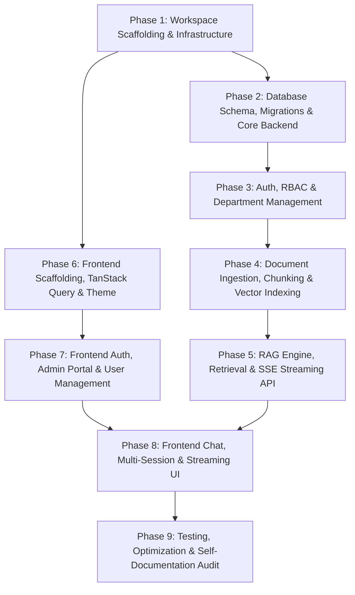

# PolicyHelper - Implementation Plan & Roadmap

This document outlines the step-by-step implementation phases for building **PolicyHelper**, following the technical specifications defined in [`ARCHITECTURE.md`](ARCHITECTURE.md).

---

## Phase Breakdown Overview

---

## Phase 1: Workspace Scaffolding & Infrastructure Setup

**Goal**: Initialize monorepo directory structure, developer tooling, Docker infrastructure, and base `guide.md` files.

- [ ] **1.1 Directory Structure Scaffolding**
  - Create `apps/api/` and `apps/web/` directory hierarchies.
  - Create all subdirectories (`core/`, `models/`, `schemas/`, `api/v1/`, `services/`, `components/`, `hooks/`, `lib/`, etc.).
  - Add initial `guide.md` in every folder explaining its scope.
- [ ] **1.2 Docker Compose Configuration (`docker-compose.yml`)**
  - Configure PostgreSQL 16+ container with `pgvector` pre-installed (`pgvector/pgvector:pg16`).
  - Configure MinIO container for local S3 simulation with pre-created bucket `policies`.
  - Configure persistent volumes and environment variables (`.env.example`).
- [ ] **1.3 Backend Environment Setup (`apps/api`)**
  - Initialize Python project with `uv` (`pyproject.toml`).
  - Install dependencies: `fastapi`, `uvicorn`, `sqlalchemy[asyncio]`, `asyncpg`, `alembic`, `pydantic-settings`, `pgvector`, `langchain`, `langgraph`, `boto3`, `python-jose`, `passlib[bcrypt]`, `openai`, `anthropic`, `google-generativeai`.
- [ ] **1.4 Frontend Environment Setup (`apps/web`)**
  - Initialize Next.js 15 (App Router, TypeScript) using `pnpm`.
  - Install dependencies: `@tanstack/react-query`, `axios`, `lucide-react`, `tailwindcss`, `class-variance-authority`, `clsx`, `tailwind-merge`.
  - Initialize `shadcn/ui` with neutral slate/zinc styling.

---

## Phase 2: Database Schema, Migrations & Core Backend

**Goal**: Establish PostgreSQL async engine, define SQLAlchemy models, and configure Alembic migrations.

- [ ] **2.1 Core Settings & Async DB Engine (`apps/api/app/core/`)**
  - Implement `config.py` using `pydantic_settings.BaseSettings` for all ENV configurations.
  - Implement `database.py` with `create_async_engine` and `async_sessionmaker`.
- [ ] **2.2 SQLAlchemy Models (`apps/api/app/models/`)**
  - Implement `Department` model (CRUD fields: `id`, `name`, `code`, `description`, `is_active`).
  - Implement `Role` model (`id`, `name`, `description`, `permissions` JSONB).
  - Implement `User` model and `user_roles` Many-to-Many junction table (`must_change_password`, `department_id` FK).
  - Implement `Document` model (`title`, `file_path`, `allowed_role_names`, `department_id` FK, `status`).
  - Implement `DocumentChunk` model with `pgvector` column `embedding vector(1536)` and `tsvector search_vector`.
  - Implement `ChatSession` model (`title`, `message_count`, `is_title_auto_generated`, `user_id` FK).
  - Implement `ChatMessage` model (`sender`, `content`, `prompt_tokens`, `completion_tokens`, `metadata`).
  - Implement `MessageCitation` model (`chunk_id`, `document_id`, `page_number`, `snippet`, `relevance_score`).
  - Implement `AuditLog` model (`action`, `user_id`, `ip_address`, `details`).
- [ ] **2.3 Alembic Migrations Setup**
  - Initialize Alembic with async driver support in `env.py`.
  - Generate and verify initial migration creating all tables, indexes (HNSW for embeddings, GIN for full-text search), and UUID extensions.

---

## Phase 3: Auth, RBAC & Department Management

**Goal**: Complete secure JWT authentication, first-time password reset flow, and Department/Role CRUD endpoints.

- [ ] **3.1 Security Core (`apps/api/app/core/security.py`)**
  - Password hashing with `bcrypt` / `argon2`.
  - JWT creation & decoding with claims: `sub`, `user_id`, `roles`, `department_id`, `must_change_password`.
  - Dependency injection for `get_current_user` and `require_roles(roles: list[str])`.
- [ ] **3.2 Auth Endpoints (`apps/api/app/api/v1/auth.py`)**
  - `POST /api/v1/auth/login`: Authenticate email/password, return access & refresh tokens.
  - `POST /api/v1/auth/change-password`: Require valid old password, hash new password, set `must_change_password=False`, issue new token.
  - `GET /api/v1/auth/me`: Return current user profile, roles, and department.
- [ ] **3.3 Department Management Endpoints (`apps/api/app/api/v1/departments.py`)**
  - `GET /api/v1/departments`: List active departments.
  - `POST /api/v1/departments`: Create department (`SUPER_ADMIN`, `HR_ADMIN`).
  - `PUT /api/v1/departments/{id}`: Update department name, code, description.
  - `DELETE /api/v1/departments/{id}`: Soft delete / deactivate department.
- [ ] **3.4 User Management Endpoints (`apps/api/app/api/v1/users.py`)**
  - `GET /api/v1/users`: Paginated list of users with roles and department details.
  - `POST /api/v1/users`: Create user with random temporary password, assign roles and department (`must_change_password=True`).
  - `PUT /api/v1/users/{id}`: Update roles, department, or active status.
  - `POST /api/v1/users/{id}/reset-password`: Admin trigger to regenerate a temp password.

---

## Phase 4: Document Ingestion, Chunking & Vector Indexing

**Goal**: Implement the Storage Strategy Pattern and LangGraph document parsing pipeline.

- [ ] **4.1 Storage Strategy Pattern (`apps/api/app/services/storage/`)**
  - Define `FileStorageService` interface (`upload_file`, `download_file`, `delete_file`, `get_file_url`).
  - Implement `LocalStorageService` (writing to local disk directory).
  - Implement `S3StorageService` (using `boto3` for AWS S3 / MinIO).
  - Implement `StorageFactory` selecting strategy via `STORAGE_TYPE` (`local` vs `s3`).
- [ ] **4.2 LLM & Embeddings Provider Strategy Pattern (`apps/api/app/services/llm/`)**
  - Define `LLMProviderService` interface (`get_chat_model`, `get_embeddings_model`).
  - Implement `OpenAIProvider` (`ChatOpenAI`, `OpenAIEmbeddings`).
  - Implement `AnthropicProvider` (`ChatAnthropic`, OpenAI/compatible embeddings).
  - Implement `GeminiProvider` (`ChatGoogleGenerativeAI`, `GoogleGenerativeAIEmbeddings`).
  - Implement `LLMProviderFactory` dynamically resolving strategies from encrypted database records.
- [ ] **4.3 LangGraph Ingestion Pipeline (`apps/api/app/services/ingestion/`)**
  - Document loaders for `.pdf`, `.docx`, `.md`, `.txt`.
  - Markdown table and structure normalization.
  - Header-Aware text splitting (`MarkdownHeaderTextSplitter` + secondary `RecursiveCharacterTextSplitter`).
  - Breadcrumb context injection (e.g., `Leave Policy > Paid Time Off > Eligibility`).
  - Vector generation and batch insertion into `document_chunks` table in PostgreSQL.
- [ ] **4.4 Document Endpoints (`apps/api/app/api/v1/documents.py`)**
  - `POST /api/v1/documents/upload`: Multipart upload with metadata (category, department, allowed roles).
  - `GET /api/v1/documents`: List uploaded documents with status and metadata.
  - `GET /api/v1/documents/{id}/download`: Stream file from configured storage service.
  - `DELETE /api/v1/documents/{id}`: Delete file from storage and cascade-delete chunks from PostgreSQL.

---

## Phase 5: RAG Engine, Retrieval & SSE Streaming API

**Goal**: Build hybrid search in PostgreSQL, LangGraph RAG execution graph, and SSE streaming with automatic session titling.

- [ ] **5.1 PostgreSQL Hybrid Search Service (`apps/api/app/services/rag/retrieval.py`)**
  - Dense cosine similarity search over `document_chunks.embedding` using `pgvector`.
  - Sparse keyword search using `document_chunks.search_vector` (`tsvector`).
  - Reciprocal Rank Fusion (RRF) / weighted score combining.
  - RBAC & Department filtering (`user_roles` matching `allowed_role_names` AND `user.department_id == doc.department_id`).
- [ ] **5.2 LangGraph RAG StateGraph (`apps/api/app/services/rag/graph.py`)**
  - Node 1: Conversational history query condensation / rephrasing.
  - Node 2: Hybrid vector + full-text retrieval with RBAC filtering.
  - Node 3: Grounded prompt synthesis with citation markers.
  - Node 4: Fallback node if no relevant chunks are found.
- [ ] **5.3 Automated Session Titling Pipeline (`apps/api/app/services/chat/title_service.py`)**
  - Background async summarizer triggered when `session.message_count >= 2` and `is_title_auto_generated == False`.
  - Lightweight LLM call generating a 3–5 word title, updating DB, and pushing `session_updated` event.
- [ ] **5.4 Chat & Streaming Endpoints (`apps/api/app/api/v1/chat.py`)**
  - `POST /api/v1/chat/sessions`: Create a new chat session.
  - `GET /api/v1/chat/sessions`: List user's sessions (grouped by date, pinned, archived).
  - `GET /api/v1/chat/sessions/{id}`: Fetch session message history with citations.
  - `PATCH /api/v1/chat/sessions/{id}`: Rename, pin, or archive session.
  - `DELETE /api/v1/chat/sessions/{id}`: Delete session and cascade messages.
  - `POST /api/v1/chat/sessions/{id}/stream`: SSE endpoint streaming `citation`, `token`, `session_updated`, `done`, and `error` events.

---

## Phase 6: Frontend Scaffolding, TanStack Query & Theme

**Goal**: Build clean, classic UI foundations with Next.js 15, Tailwind, shadcn/ui, TanStack Query, and Axios.

- [ ] **6.1 Design System & Theme Foundations (`apps/web/`)**
  - Configure Tailwind with subtle slate/zinc neutral palette and subtle borders.
  - Setup classic typography (Geist / Inter) with clean hierarchy.
  - Install and style core `shadcn/ui` primitives (Button, Input, Dialog, Dropdown, Table, Card, Badge, Sheet, ScrollArea, Tooltip, Skeleton).
- [ ] **6.2 Axios HTTP Client & Interceptors (`apps/web/lib/api/`)**
  - Setup centralized Axios instance with baseURL.
  - Request interceptor attaching Bearer token.
  - Response interceptor catching 401 Unauthorized and redirecting if `must_change_password=True`.
- [ ] **6.3 TanStack React Query Configuration (`apps/web/lib/query/`)**
  - Configure `QueryClient` with standard caching and stale-time defaults.
  - Create global `QueryProvider` wrapping layout.

---

## Phase 7: Frontend Auth, Admin Portal & User Management

**Goal**: Implement responsive auth pages (Login, Mandatory Password Reset), Admin Document Manager, and Department/User portals.

- [ ] **7.1 Authentication Pages & Guard Hooks**
  - `app/(auth)/login/page.tsx`: Clean, distraction-free login form.
  - `app/(auth)/change-password/page.tsx`: Mandatory password change screen on first login.
  - `hooks/useAuth.ts`: Login, logout, change password, and auth state queries/mutations.
  - Next.js middleware / layout guard enforcing route protection and password reset redirection.
- [ ] **7.2 Admin Document Management (`app/(dashboard)/documents/`)**
  - Modular components: `upload-dropzone.tsx`, `document-table.tsx`, `document-status-badge.tsx`, `document-filter-bar.tsx`.
  - `hooks/useDocuments.ts`: React Query mutations for upload, deletion, and status polling.
- [ ] **7.3 Admin User & Department Management (`app/(dashboard)/users/` & `departments/`)**
  - `user-table.tsx`, `create-user-modal.tsx` (displaying auto-generated password on creation), `edit-user-modal.tsx`.
  - `department-table.tsx`, `department-form-dialog.tsx`.
  - `hooks/useUsers.ts` and `hooks/useDepartments.ts`.

---

## Phase 8: Frontend Chat, Multi-Session & Streaming UI

**Goal**: Implement the responsive employee chat interface, multi-session sidebar, SSE streaming, and interactive citations.

- [ ] **8.1 Multi-Session Sidebar (`components/chat/sidebar/`)**
  - Modular components: `session-list.tsx`, `session-item.tsx`, `session-group.tsx` (Today, Previous 7 Days, Older), `session-search.tsx`.
  - Actions: New chat, rename, pin, archive, delete session.
  - Real-time title update on `session_updated` event.
  - Responsive: Desktop collapsible panel / Mobile slide-out sheet.
- [ ] **8.2 Chat Message Area (`components/chat/messages/`)**
  - Modular components: `message-list.tsx`, `message-item.tsx`, `streaming-cursor.tsx`, `empty-state.tsx`.
  - Clean Markdown renderer for policy text, tables, bullet points, and code blocks.
- [ ] **8.3 Interactive Citations & Document Viewer (`components/chat/citations/`)**
  - Modular components: `citation-badge.tsx`, `citation-drawer.tsx`, `pdf-preview-modal.tsx`.
  - Clicking citation chips opens exact source snippet with document title and page number.
- [ ] **8.4 Streaming Chat Hook (`hooks/useChatStream.ts`)**
  - Optimistic message append in TanStack Query cache.
  - Native `ReadableStream` reader parsing SSE events (`citation`, `token`, `session_updated`, `done`).
  - Cache invalidation on completion.

---

## Phase 9: Testing, Optimization & Self-Documentation Audit

**Goal**: Full verification, error handling, performance tuning, and `guide.md` documentation audit.

- [ ] **9.1 Backend Integration & Unit Tests (`apps/api/tests/`)**
  - Unit tests for Storage strategy classes (`LocalStorageService`, `S3StorageService`).
  - Unit tests for LLM provider strategy classes (`OpenAI`, `Anthropic`, `Gemini`).
  - API endpoint integration tests (Auth, Users, Departments, Documents, Chat).
- [ ] **9.2 Frontend Responsiveness & DRY Code Audit**
  - Verify all components conform to single-responsibility (no monolithic files $>150-200$ lines).
  - Verify subtle and classic UI styling across mobile, tablet, and desktop breakpoints.
- [ ] **9.3 `guide.md` Self-Documentation Verification**
  - Ensure every folder across `apps/web/` and `apps/api/` contains an accurate `guide.md` with file indexes and context links.
- [ ] **9.4 End-to-End Verification**
  - Full flow: Admin creates department/user $\rightarrow$ User logs in & resets password $\rightarrow$ Admin uploads PDF $\rightarrow$ Chunks embedded in pgvector $\rightarrow$ User chats $\rightarrow$ Tokens stream with citations $\rightarrow$ Session title auto-generated.

---

## Getting Started

To execute this plan, we begin with **Phase 1: Workspace Scaffolding & Infrastructure Setup**.
